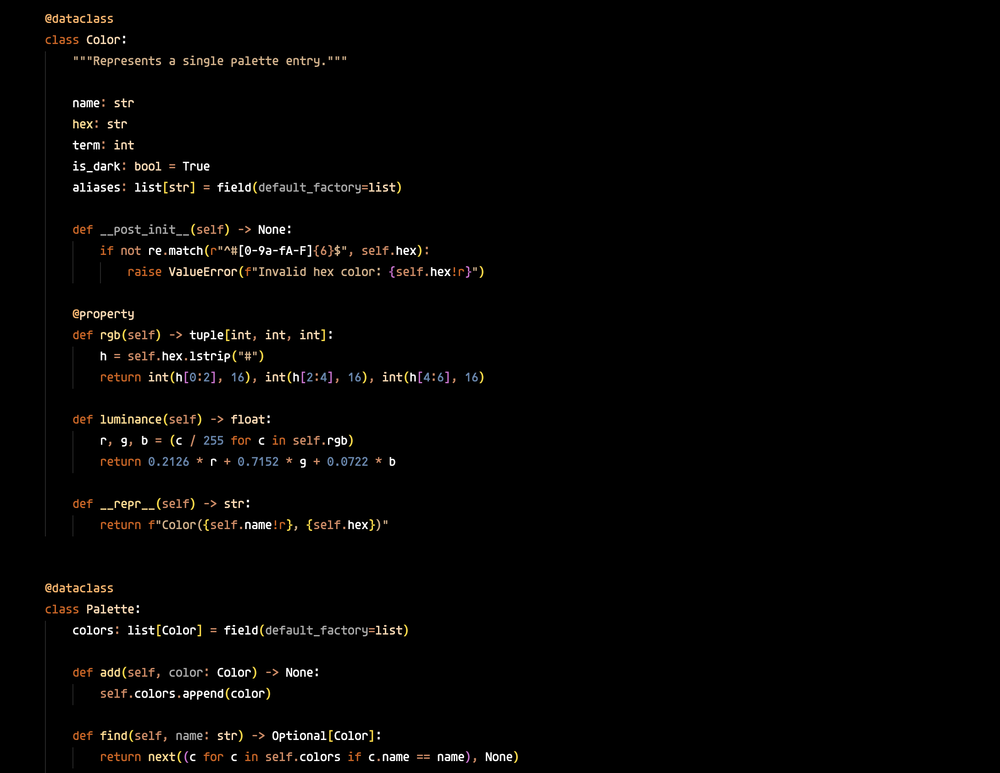
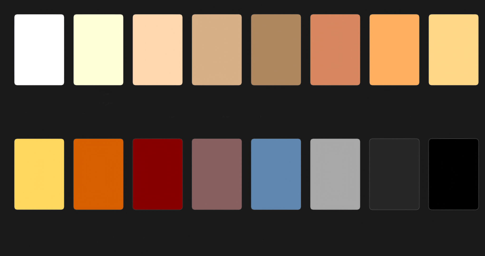

# Fahrenheit

A dark, warm color theme for VS Code, ported from [vim-fahrenheit](https://github.com/fcpg/vim-fahrenheit) by fcpg.

Built on a 256-color base16 palette ranging from ember black to scorched orange to blazing white.

## Screenshot



## Palette



| Color      | Hex       | Role                    |
| ------------| -----------| -------------------------|
| Background | `#000000` | Editor background       |
| Surface    | `#262626` | Line highlight, widgets |
| Comment    | `#875f5f` | Comments                |
| Muted      | `#a8a8a8` | Variables, identifiers  |
| String     | `#d7af87` | Strings                 |
| Type       | `#ffd7af` | Types, classes          |
| Function   | `#ffd787` | Functions               |
| Number     | `#5f87af` | Numbers, booleans       |
| Keyword    | `#d75f00` | Keywords, statements    |
| PreProc    | `#ffaf5f` | Imports, macros         |
| Foreground | `#ffffff` | Default text            |

## Installation

Download `fahrenheit-theme-1.0.1.vsix` from the [latest release](https://github.com/Tanvir101cmd/vscode-fahrenheit-theme/releases/latest), then run:

```sh
#VSCode
code --install-extension fahrenheit-theme-1.0.1.vsix


#VSCodium
codium --install-extension fahrenheit-theme-1.0.1.vsix
```

Then open the Command Palette (`Ctrl+Shift+P` / `Cmd+Shift+P`) → **Preferences: Color Theme** → **Fahrenheit**.

## Credits

Original Vim colorscheme by [fcpg](https://github.com/fcpg/vim-fahrenheit), licensed under [CC BY-SA 4.0](https://creativecommons.org/licenses/by-sa/4.0/).

## License

[CC BY-SA 4.0](https://creativecommons.org/licenses/by-sa/4.0/)
